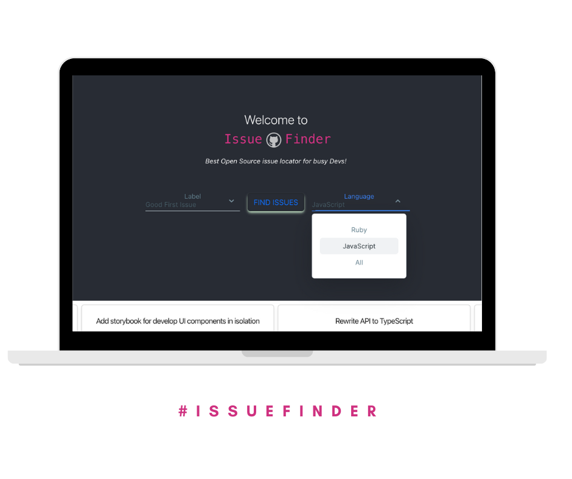

# Issue-Finder

> A search engine to find newbie-friendly github issues. The issue finder helps you find a list of beginner-friendly GitHub repos, backed by Y Combinator, that have Ruby and Javascript issues that are good for new contributors.

Watch [this short video](https://youtu.be/Qf5VvoZmzNo) to discover the initial inspiration to create Issue Finder and learn the basics of Open Source. 

Your Open Source Finder

## Issue Finder Live

[Demo](https://github-issue-finder.netlify.app/)

## Learn About Issue Finder from the first Contributors

### Issue Scraper Logic - Repository Owner
[Video: Oscar Mier](https://youtu.be/Jl4GdOiZ4tk)

### React/Redux Logic | API's | Actions - Project Maintainer
[Video: Shadman Ali](https://lnkd.in/gmua_37B)

### UI - Project Maintainer
[Video: Steve W Dames Jr](https://lnkd.in/emedpJqU)

### Data Retrieval From Github API
[Video: Jose Ramon Castaños](https://lnkd.in/en2wkyaH)

### API Request from Y Combinator
[Video: Ricardo Valtierra](https://bit.ly/3Sg7aPF)

> Honorable Mentions:

### Firebase Analytics

[Linkedin Post: Denis Lafontant](https://www.linkedin.com/feed/update/urn:li:activity:6980560571465146368?utm_source=share&utm_medium=member_desktop)

## Built With

- JavaScript
- REACT
- REDUX
- THUNK
- Tailwind CSS

## Milestones

- [x] Milestone 1: Setup the project and install dependencies
- [x] Milestone 2: Setup Redux store
- [x] Milestone 3: Setup thunk
- [x] Milestone 4: Add label logic
- [x] Milestone 5: Add filter logic
- [x] Milestone 6: Create basic UI/UX to display App information
- [x] Milestone 7: Add Analytics support
- [x] Milestone 8: Refactor and optimize components/redux
- [x] Milestone 9: Update Meta for SEO
- [x] Milestone 10: Deploy live APP

- [x] Debug linter errors

## Screenshots

## Getting Started

To get a local copy up and running follow these simple example steps.

## Pre-requisites

- Text Editor
- Git and Github set up

## Usage

In your terminal, navigate to the directory you would like to store the project and run this code:

`git clone https://github.com/voscarmv/issue-finder.git`

Then run:

`cd issue-finder`

Open the project in your favorite code editor `code .` for VS Code.

### Dependencies

- Run `npm install` - to install the necessary packages listed in the package.json file
- Run `touch .env`
- > Generate your GitHub token here https://github.com/settings/tokens
- Run `echo REACT_APP_API_KEY=ghp_my_github_token > .env` make sure you replace `ghp_my_github_token` with your generated token
- Then in your terminal type `npm start` and view app in your browser

- Then in your terminal run `npm start` and view app in your browser 

### Linter Setup

- Run `npx eslint .` which will print any errors found.
- Run `npx eslint . --fix` to automatically fix the errors.

### `npm test`

Launches the test runner in the interactive watch mode.\
See the section about [running tests](https://facebook.github.io/create-react-app/docs/running-tests) for more information.

### `npm run build`

Builds the app for production to the `build` folder.\
It correctly bundles React in production mode and optimizes the build for the best performance.

The build is minified and the filenames include the hashes.\
Your app is ready to be deployed!

See the section about [deployment](https://facebook.github.io/create-react-app/docs/deployment) for more information.

## Usage

- Select a label from the first drop down menu
- Select a language from the second drop down menu
- Click `FIND ISSUES` to filter through great issues matching your search query
- Click on a issue from the list of issues below to view your next open source contribution on GitHub

Make some coffee in the time you saved finding an amazing issue for your next contribution!

## Author 1:

👤 **OSCAR MIER**

- GitHub: [@voscarmv](https://github.com/voscarmv)
- YouTube: [Oscar Mier](https://www.youtube.com/channel/UCLedI7TWQMIp5-ovGgMaa5g)
- LinkedIn: [Oscar Mier ](https://www.linkedin.com/in/oscar-mier-072984196/)

## Author 2:

👤 **SHADMAN ALI**

- GitHub: [@shadmanhere](https://github.com/shadmanhere)
- Twitter: [@shadmanhere](https://twitter.com/shadmanhere)
- LinkedIn: [Shadman Ali](https://www.linkedin.com/in/shadmanhere/)

## Author 3:

👤 **STEVE W DAMES JR**

- GitHub: [@steveWDamesJr](https://github.com/steveWDamesJr)
- Twitter: [@SteveWDamesJr](https://twitter.com/Stevewdamesjr)
- LinkedIn: [Steve W Dames Jr](https://www.linkedin.com/in/steve-w-dames-jr/)

## Author 4:

👤 **JOSE RAMON**

- GitHub: [@jr-cast](https://github.com/jr-cast)
- Twitter: [@josercastanos](https://twitter.com/josercastanos)
- LinkedIn: [Jose Ramon Castaños](https://linkedin.com/in/jr-cast)

## Author 5:

👤 **RICARDO VALTIERRA**

- GitHub: [@ricardovaltierra](https://github.com/ricardovaltierra)
- Twitter: [@RicardoValtie15s](https://twitter.com/RicardoValtie15)
- LinkedIn: [Ricardo Valtierra](https://www.linkedin.com/in/ricardovaltierra/)

## Author 6:

👤 **DENIS LAFONTANT**

- GitHub: [@icebox827](https://github.com/icebox827)
- Twitter: [@heracles2k5](https://twitter.com/heracles2k5)
- LinkedIn: [Denis Lafontant](https://www.linkedin.com/in/denis-lafontant-37031439/)

## 🤝 Contributing

Join our [Whatsapp group](https://www.youtube.com/redirect?event=video_description&redir_token=QUFFLUhqbVphS0JSZ3I0YkkwZDZqVm0wa18tRV9nZE0xd3xBQ3Jtc0tuZXhkZ0hYNEp5c0tlLTZMclVGby1YaHpkZ0FIdHhnNEswNUwxR3Nra0YtTHFncXBGbWFFcUNhSVRlTlNFRVF2TlZoRHlzTnZTcm5tOGVHQm9SM3ZESzJ3dExZUmd5QnFuVWV1aVhFZWNRRm5ZMWdNTQ&q=https%3A%2F%2Fchat.whatsapp.com%2FDaV0lQYApPDJcI2Nz2GlYD&v=Jl4GdOiZ4tk)!

Contributions, issues, and feature requests are welcome!

Feel free to check the [issues page](https://github.com/voscarmv/issue-finder/issues).

## Show your support

Give a ⭐️ if you like this project!

## Acknowledgments

- Hat tip to anyone whose code was used.

## 📝 License

This project is [MIT](./MIT.md) licensed.
